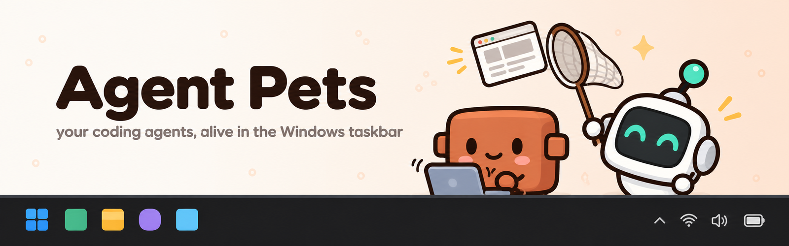
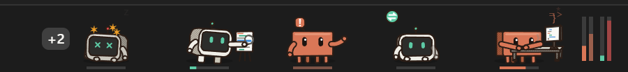
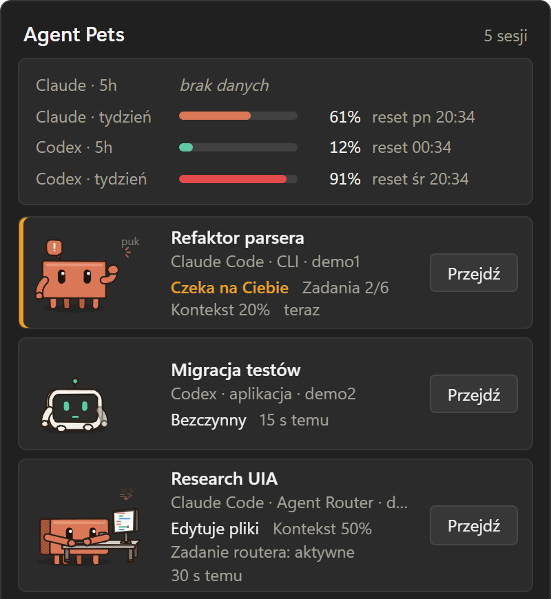
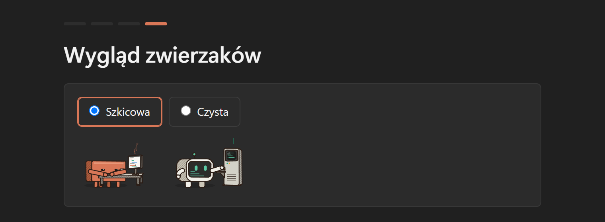
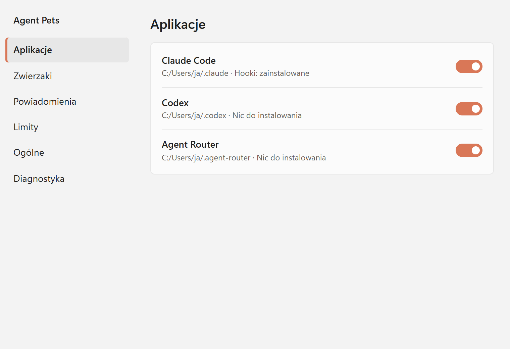

<p align="center">
  
</p>

<p align="center">
  <a href="https://github.com/Marczelloo/agent-pets/releases/latest"></a>
  
  <a href="LICENSE"></a>
</p>

# Agent Pets

Animated pets that live in the Windows 11 taskbar and show what your coding agents are doing: **Claude Code**, **OpenAI Codex** and **Agent Router** tasks. Each session gets its own pet. The pet codes at a desk, types commands into a terminal, reads files, catches web pages with a butterfly net, waves when it needs you, dances when it's done, and naps when idle. Progress, context usage and rate limits show up next to it.

<p align="center">
  
</p>

> **Status: public beta (0.7).** [Download the installer](https://github.com/Marczelloo/agent-pets/releases/latest), pick your agents in the first-run wizard, done. What works is listed in [What works now](#what-works-now).

## Highlights

- **One pet per session.** Clawd for Claude Code, Kodek for Codex. Their pose follows the session: thinking, editing, running commands, reading, searching, browsing, delegating to subagents, waiting for you, done, error, idle, asleep.
- **Everything at a glance.** Task progress under each pet, 5-hour and weekly limits for Claude and Codex next to them, a "+N" badge when the taskbar runs out of room. Pets that wait for you never get hidden.
- **Panel and "Przejdź" (Go).** Click a pet for all your sessions and limits with reset times; one click takes you back to the session: the Claude or Codex app, its terminal window, or a new terminal that resumes it.
- **Seven looks and two ways to move.** Sticker (like the app icon), Sketch, Clean, Pixel art, Neon, Ink and Pastel, all readable at taskbar size, plus a Dynamic motion mode with anime-inspired scenes: a punch barrage on the keyboard with a final BAM!, ninja hand seals before a command, a detective with a giant magnifier, Shikamaru-style thinking, a thunder dash for the web, a summoning seal for subagents, Hollow Purple while compacting, and particles, impact frames and speed lines. Pick one look for everyone or a different one per agent, and preview every animation in Settings.
- **Your taskbar, your layout.** Put the pets next to the tray, on the left, anywhere you drag them, or in a floating window on the desktop; pick the monitor, a glass or solid background, the pet size, spacing, order (by start, agent, or those that need you first) and which bars show. Settings → Taskbar.
- **Tidy up by hand.** Remove a pet from the taskbar (right-click it) or a session from the panel (✕, or "Remove inactive"), with undo. It comes back on its own as soon as the agent does something new.
- **Updates itself.** A notification when a new version is out, with an Install button, or silent installs at a quiet moment (no agent working, no full-screen game). Updates are signed and checked before they run.
- **Music break.** When Spotify, Apple Music, a browser or any other player is playing in Windows, idle pets put on headphones and dance, and sleeping ones doze on in headphones. Grey EQ bars replace the progress bar and the tooltip says "Idle · Spotify playing", so a dance never looks like work; when the agent starts working, the headphones fly off. Track titles are never read; turn it off in Settings → Look.
- **Windows notifications** when an agent waits for you, finishes a long turn, or passes 90% of a limit.
- **Agent Router tasks** get the task's title, a router badge and live health (active, quiet, stalled, blocked).
- **English and Polish.** Pets, panel, settings, notifications and the installer follow your Windows language, or pick one in Settings.
- **Private by default.** Everything is read from local files and hooks. Besides the update check on GitHub (can be turned off), the only optional network call, fetching your Claude plan limits from Anthropic, is off until you allow it.
- **Light on resources.** Drawing stops under full-screen apps and when the taskbar is hidden; on battery the pets slow down to 10 fps.

| Panel | First-run wizard | Settings |
|---|---|---|
|  |  |  |

The interface is in English and Polish and follows the Windows display language; change it in Settings → General. Design documents (spec, plans, spike reports) are in Polish.

## What works now

| Piece | State | How to try it |
|---|---|---|
| **Taskbar stage** (`app/`): live pets, progress, rate limits, "+N" overflow, tooltip | ✅ | [Run the taskbar pets](#run-the-taskbar-pets) |
| **Panel**: all sessions, limits, "Przejdź" (jump to session) | ✅ | click a pet or the tray icon, see [Panel and jump to session](#panel-and-jump-to-session) |
| **Windows notifications**: waiting for you, long turn done, limit over 90% | ✅ | [Notifications](#notifications) |
| Claude rate limits (5h and weekly) with reset times | ✅ | from your Claude plan, see [Claude rate limits](#claude-rate-limits) |
| **Data core** (`pets-core`, `pets-cli`, `hook.exe`) | ✅ Done | `pets-cli run`: live table of all agent sessions |
| Claude Code sessions (CLI and desktop) | ✅ | states from hooks; title, context and progress from transcripts |
| Codex sessions (desktop, CLI, Agent Router) | ✅ | states, tools, context and 5h/weekly limits from rollout files |
| Agent Router tasks: title, health, failures, router badge | ✅ | from `~/.agent-router/status.json`, see [Agent Router tasks](#agent-router-tasks) |
| Record and replay of session events | ✅ | `pets-cli run --record`, `pets-cli replay` |
| **Visual prototype** of the pets (animations, props, sketch style) | ✅ Prototype | open `prototype/index.html` in a browser |
| **Installer, first-run wizard, settings**, autostart, power saving | ✅ | [Install](#install) |
| **Automatic updates** (notify or install at a quiet moment), signed | ✅ from 0.7 | Settings → General |
| **Taskbar layout**: position, monitor, floating window, background, size, order; remove pets and sessions | ✅ from 0.7 | Settings → Taskbar, right-click a pet |
| More agents (opencode, Gemini CLI and others), statistics | ⏳ Next phases | see [Roadmap](#roadmap) |

## Install

1. Download `Agent.Pets_<version>_x64-setup.exe` from [GitHub Releases](https://github.com/Marczelloo/agent-pets/releases).
2. Run it. The installer is not code-signed yet, so Windows SmartScreen may warn you: choose **More info → Run anyway**. It installs for your user only, no administrator rights.
3. The first-run wizard asks:
   - which apps get pets. It shows the ones it found: Claude Code (`~/.claude`), Codex (`~/.codex`), Agent Router (`~/.agent-router`). For Claude Code it installs hooks in `~/.claude/settings.json` and keeps a backup;
   - whether to fetch Claude plan limits from Anthropic (off by default, see [Claude rate limits](#claude-rate-limits));
   - notifications and starting with Windows;
   - the look: one of seven styles and calm or dynamic motion, from a live gallery.
4. Restart open Claude Code sessions so they pick up the hooks.

Change anything later in **Settings**: right-click the tray icon, or the ⚙ button in the panel. Running Agent Pets again from the Start menu opens Settings too.

**Updates:** from 0.7 on, Agent Pets checks GitHub for a new version 15 seconds after start and every 6 hours and tells you, or installs it by itself at a quiet moment if you choose so in Settings → General (or turn it off). Versions before 0.7 have no updater: install 0.7 by hand once.

**Uninstall** from Windows Settings → Apps. It removes the hooks (and the statusline pass-through, restoring your previous statusline), the autostart entry and the files in `~/.agent-pets`. Tick "delete app data" to remove your settings as well.

**Power saving:** on battery or with Windows energy saver on, the pets draw at 10 frames per second and only busy pets move. Set it to always or never in Settings → Pets.

## Build from source

### Requirements

- Windows 11
- [Rust](https://rustup.rs) 1.93 or newer (MSVC toolchain)
- [Node.js](https://nodejs.org) 22 and [pnpm](https://pnpm.io) 10 (for the taskbar app)
- Optional: Python 3 (only for the fixture anonymizer)
- Claude Code and/or Codex, if you want to see real sessions

### Setup

```powershell
git clone https://github.com/Marczelloo/agent-pets.git
cd agent-pets\app
pnpm install
pnpm build:hook      # builds hook.exe into src-tauri/resources; the app bundles it and needs it to compile
pnpm test
cd ..
cargo build --release --workspace
cargo test --workspace
```

`pnpm tauri build` (in `app/`) produces the installer in `target\release\bundle\nsis\`. The build also signs the update files and needs the release key, which only the maintainer has; for your own build turn that off with `pnpm tauri build --config '{"bundle":{"createUpdaterArtifacts":false}}'`. Releases are made with `scripts/release.ps1`, see [docs/release.md](docs/release.md).

#### Connect Claude Code (hooks) without the wizard

Claude Code reports session state through hooks. `hook.exe` is tiny: it forwards each hook payload to the local data core and always exits with code 0 within about 0.3 s, even when the core isn't running. It never blocks or slows down Claude.

Copy it somewhere stable first, so rebuilds don't lock the file while hooks are running. Use your home directory, not `AppData`: Windows virtualizes `AppData` for apps installed as MSIX packages (such as the Claude desktop app and its built-in terminal), so a hook started by Claude could see different files there than the widget does.

```powershell
mkdir $HOME\.agent-pets -Force
copy target\release\hook.exe $HOME\.agent-pets\hook.exe
target\release\pets-cli.exe install-hooks $HOME\.agent-pets\hook.exe
```

Claude Code reads hooks when a session starts, so restart running sessions after installing or moving the hooks.

`install-hooks` merges nine entries into `~/.claude/settings.json` and keeps a backup as `settings.json.agent-pets.bak`. To remove only the Agent Pets entries:

```powershell
target\release\pets-cli.exe uninstall-hooks
```

Codex needs no setup. Its session files in `~/.codex/sessions` are read directly.

## Usage

```powershell
target\release\pets-cli.exe run                          # live table of sessions and limits (Ctrl+C to quit)
target\release\pets-cli.exe run --record session.jsonl   # also record normalized events
target\release\pets-cli.exe replay session.jsonl --speed 10
```

Example output:

```
agent   źródło   stan              postęp kontekst   cisza  tytuł
claude  desktop  working:bash         2/5      63%      0s  Taskbar widget for agents
codex   router   done                   -       7%      7s  Count Rust files in crates
claude  cli      sleep                  -       5%   1162s  Weather and date tasks

Limity:
  codex 5h: 0% (reset za 299 min)
  codex tydzień: 15% (reset za 7579 min)
```

To try replay without any agents: `target\release\pets-cli.exe replay crates\pets-cli\tests\data\sample.jsonl --speed 4`.

### Run the taskbar pets

```powershell
cd app
pnpm tauri dev                                                         # live sessions
$env:AGENT_PETS_REPLAY="$PWD\demo\many-sessions.jsonl"; pnpm tauri dev  # demo recording with 7 sessions
pnpm dev                                                               # browser preview: http://localhost:1420/dev.html
```

- The pets sit in the taskbar next to the tray and take only the free space after your app icons. When space runs out, the oldest pets collapse into a "+N" badge; a pet that waits for you or hit an error always stays visible.
- Hover a pet, the rate-limit bars or the "+N" badge for details. Click to open the panel.
- Quit from the tray icon's right-click menu: **Zakończ Agent Pets**.
- The app and `pets-cli run` cannot run at the same time (both own the hook endpoint).
- `pnpm tauri build` produces `target\release\agent-pets.exe`.

### Panel and jump to session

Click a pet (the panel opens on its session), the "+N" badge, the limit bars or the tray icon. The panel lists every session, including the ones folded into "+N", with sessions waiting for you or failing on top, and shows 5h and weekly limits for Claude and Codex. It hides when you click elsewhere or press Esc.

**Przejdź** takes you to the session. It tries these steps in order and stops at the first one that works:

1. a deep link: the session in the Claude app (`claude://code/continue`) or the thread in the Codex app (`codex://threads/…`);
2. the window the session runs in (for example its Windows Terminal tab's window);
3. a new terminal in the session's folder with `claude --resume <id>` or `codex resume <id>`;
4. the resume command copied to the clipboard; the panel says so.

Session ids reach URLs and process arguments only when they contain nothing but letters, digits, `-` and `_`.

`pnpm dev` also serves a browser preview of the panel with demo data at http://localhost:1420/panel.html.

### Notifications

Windows toasts, signed "Agent Pets", with a **Przejdź** button:

| When | Condition |
|---|---|
| Waiting for you | a session waits for you for more than 15 s and its window is not in front |
| Done | a turn that took more than 2 minutes finished |
| Limit | a 5h or weekly limit passed 90%, once per limit window |

Nothing already going on when the app starts is reported. To turn toasts off, use Windows Settings → System → Notifications → Agent Pets (settings inside the app come in phase 5).

### Claude rate limits

Codex limits come from its session files. For Claude there are three sources; the newest reading wins:

- **Your Claude plan** (opt-in in the wizard or Settings → Limits). Every 5 minutes the app asks `https://api.anthropic.com/api/oauth/usage` for your plan usage, the same request `/usage` in Claude Code makes, with the login Claude Code keeps in `~/.claude/.credentials.json`. It gives exact percentages and reset times at once, with no session running. The token is read for each request, sent only to `api.anthropic.com` and never stored or logged. If you are not logged in to Claude Code, or the token has expired, the other two sources remain.
- **The Claude app.** It saves your plan usage every 5 to 15 minutes in `plan-usage-history.json` in its data folder. Agent Pets reads the latest sample (5h and weekly percent) while the Claude app runs. The file has no reset times.
- **Statusline pass-through** (optional, not needed when the plan request works). Claude Code in the terminal passes the exact limits with reset times to its statusline command. `hook.exe --agent-pets-statusline` forwards them to the widget and prints exactly what your previous statusline printed (nothing, if you had none). Only CLI sessions run the statusline, the Claude app does not.

```powershell
target\release\pets-cli.exe install-statusline $HOME\.agent-pets\hook.exe   # previous statusLine saved in ~/.agent-pets/statusline-original.json
target\release\pets-cli.exe uninstall-statusline                           # restores it
```

Your previous statusline command runs through `cmd`. A command that only works in Git Bash will print nothing while the pass-through is installed.

### Agent Router tasks

[Agent Router](https://github.com/Marczelloo/agent-router-mcp) lets Claude Code hand tasks to Codex. Its tasks already show up as Codex pets, because each one runs in a Codex thread. With a router version that writes `~/.agent-router/status.json`, the pet of a router task also gets:

- the task's title;
- a small router badge above its left arm;
- the task's health in the tooltip and the panel: active, quiet (no events for 30 s), stalled (longer than the router's stall threshold, 3 min by default) or blocked; stalled and blocked are highlighted;
- an error state when the task failed or ran out of quota.

The status file holds only a short title per task, never the task text, diffs or commands. The router works the same without the widget.

### See the prototype

Open `prototype/index.html` in a browser. Buttons switch states and tools, and the bottom strip shows the real taskbar size.

## How it works

```
Claude Code ──hook.exe──HTTP (127.0.0.1 + token)──┐
Codex  ──~/.codex/sessions/**/rollout-*.jsonl──────┼─► adapters ─► state machine ─► taskbar stage
Claude transcripts + ~/.claude/sessions registry ──┤
Agent Router ──~/.agent-router/status.json─────────┘
```

- **`pets-core`** is the library. It holds:
  - the data model;
  - the state machine: `thinking`, `working:<tool>`, `needs_you`, `done`, `error`, `idle`, `sleep`, `compacting` and `ended`, with a minimum time per state and inactivity timeouts;
  - the Claude hook, transcript and registry adapters;
  - the Codex rollout parser;
  - an incremental file tailer, a file watcher, the local ingest server and the hooks installer.
- **`hook.exe`** is the Claude Code hook client and, with `--agent-pets-statusline`, the statusline pass-through.
- **`pets-cli`** runs everything as a terminal app, with record and replay.
- **`app/`** is the Tauri app. Rust embeds the stage window in the taskbar (`SetParent` into `Shell_TrayWnd`), measures the free space with UI Automation, follows DPI and Explorer restarts, reads the mouse natively and shows the tooltip window. The TypeScript side draws the pets on a Canvas at 30 fps and pauses while the taskbar is hidden or a fullscreen app runs. The renderer is a 1:1 port of the prototype, checked call-by-call against it in tests.
- **Privacy:** session data stays on your machine. Outgoing connections: the update check (`latest.json` and the installer from this repository's GitHub releases, nothing is sent; off in Settings → General) and the opt-in plan-usage request to `api.anthropic.com` described in [Claude rate limits](#claude-rate-limits). The ingest server listens only on `127.0.0.1` and requires a random token, stored with its port in `~/.agent-pets/endpoint.json`. From transcripts only titles, task progress and token counters are kept, never message content.

## Project layout

```
crates/pets-core    core library (model, state machine, adapters, ingest, watcher, settings, integrations)
crates/pets-hook    hook.exe
crates/pets-cli     pets-cli (run / replay / install-hooks / uninstall-hooks / install-statusline / uninstall-statusline)
app/                Tauri app: taskbar stage, renderer, skins, tooltip, panel and settings (React), jump, notifications, installer
docs/images/        README banner and screenshots (demo data)
prototype/          visual prototype of the pets (Canvas 2D)
spikes/             throwaway feasibility spikes (taskbar embed, statusline dump)
docs/               spec, plans, spike reports, verification checklists (Polish)
tools/              fixture anonymizer and its test, CPU measurement
```

## Roadmap

1. ~~Phase 0: feasibility spikes~~ (taskbar embed, performance, Claude limits, jump to session, data formats)
2. ~~Phase 1: data core~~
3. ~~Phase 2: taskbar stage in Tauri with the live pets, tooltip, overflow~~
4. ~~Phase 3: panel with sessions and limits, "jump to session", Windows notifications, Claude rate limits~~
5. ~~Phase 4: Agent Router task state file~~
6. ~~Phase 5: installer, first-run wizard, settings, autostart, power-saving mode~~
7. ~~Looks: seven styles (sticker and pixel art as their own models), dynamic motion, preview of every animation, English UI~~
8. ~~0.7: automatic updates, removing pets and sessions by hand, taskbar layout (position, monitor, floating window, background, size, order)~~
9. **Next (0.8):** speech bubbles above the pets, subagents
10. Later: more agents (opencode, t3code, zcode, Gemini CLI, Grok), statistics

## License

[MIT](LICENSE)
