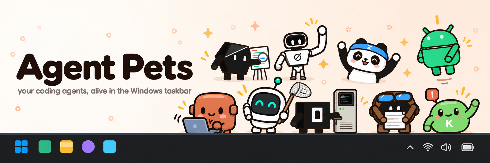
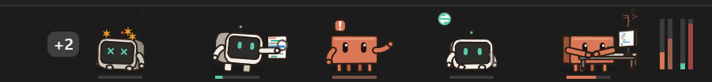
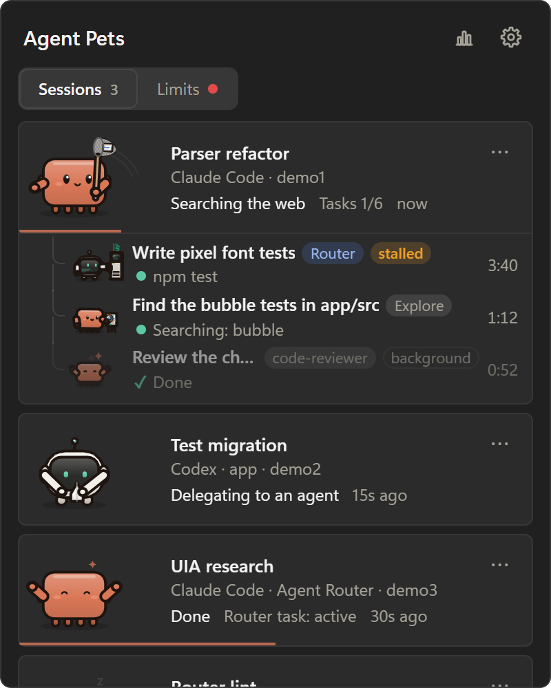
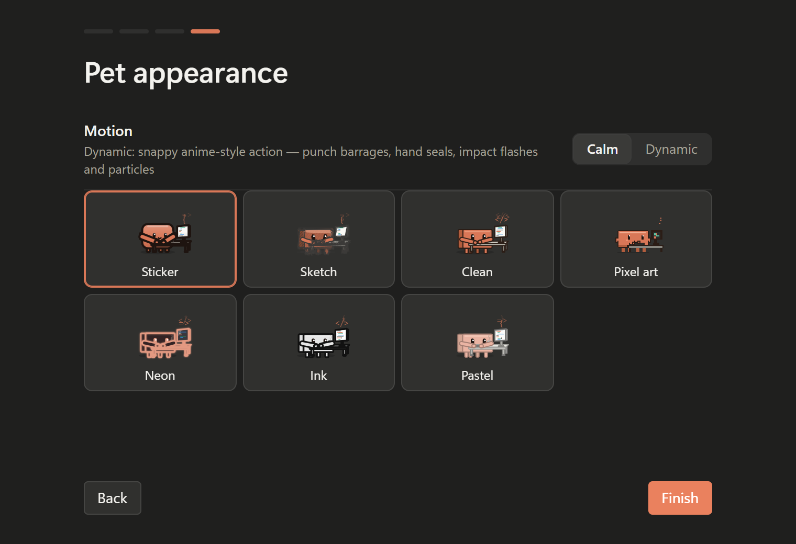
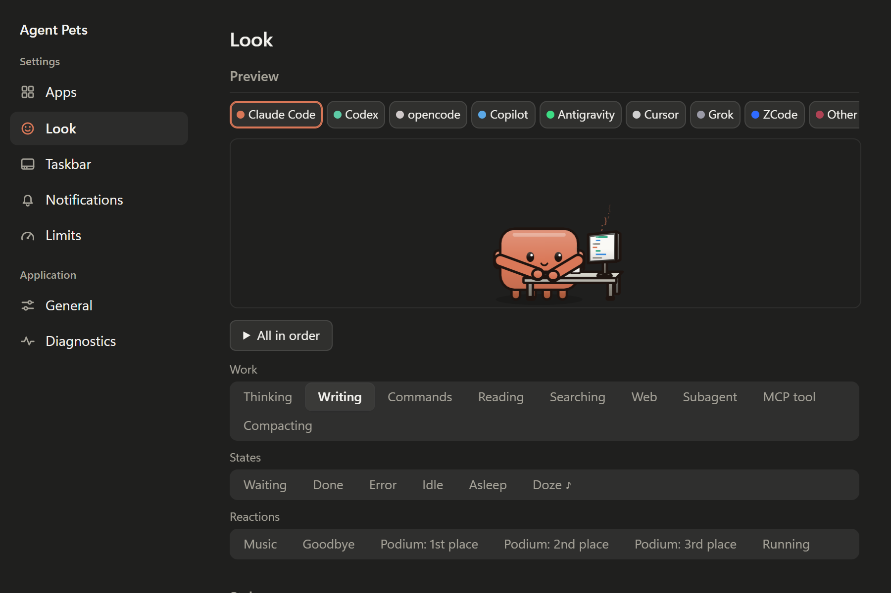

<p align="center">
  
</p>

<p align="center">
  <a href="https://github.com/Marczelloo/agent-pets/releases/latest"></a>
  
  <a href="LICENSE"></a>
</p>

# Agent Pets

Animated pets that live in the Windows 11 taskbar and show what your coding agents are doing: **Claude Code**, **OpenAI Codex**, **opencode**, **GitHub Copilot**, **Cursor**, **Grok Build**, **ZCode**, **Antigravity** and **Agent Router** tasks, plus any other tool through a small local API. Each session gets its own pet. The pet codes at a desk, types commands into a terminal, reads files, catches web pages with a butterfly net, waves when it needs you, dances when it's done, and naps when idle. Progress, context usage and rate limits show up next to it.

<p align="center">
  
</p>

> **Status: public beta (0.12).** [Download the installer](https://github.com/Marczelloo/agent-pets/releases/latest), pick your agents in the first-run wizard, done. What works is listed in [What works now](#what-works-now).

## Highlights

- **One pet per session.** Clawd for Claude Code, Kodek for Codex, a square near-black cyclops whose eye is the "o" from the opencode logo, a pilot in a brown leather helmet with blue goggles for Copilot, a floating arch in the Google colours for Antigravity, a dark faceted block for Cursor, a dark ball with a slash and cheeky brows for Grok Build, a panda with a blue “Z” headband for ZCode, and a round blob in its own colour with the first letter of its name for any other agent. Their pose follows the session: thinking, editing, running commands, reading, searching, browsing, delegating to subagents, waiting for you, done, error, idle, asleep.
- **Agent, model and program.** The pet belongs to the agent that runs the loop (Claude Code, Codex, opencode…); the tooltip and panel name the model it talks to and the program you drive it from: "Claude Code · Opus 5.5 · t3code", "opencode · GPT-6 Sol · VS Code". Programs such as t3code, VS Code, Cursor, Zed or JetBrains IDEs are found by walking up the agent's process tree, and "Przejdź" (Go) brings their window forward.
- **A door for other agents.** Any tool can report its state with one HTTP call or `hook.exe report` and gets a pet of its own. See [Door for other agents](#door-for-other-agents).
- **Everything at a glance.** Task progress under each pet, 5-hour and weekly limits for Claude and Codex next to them, a "+N" badge when the taskbar runs out of room. Pets that wait for you never get hidden.
- **Panel and "Przejdź" (Go).** Click a pet for all your sessions and limits with reset times; one click takes you back to the session: the Claude or Codex app, its terminal window, or a new terminal that resumes it.
- **Seven looks and two ways to move.** Sticker (like the app icon), Sketch, Clean, Pixel art, Neon, Ink and Pastel, all readable at taskbar size, plus a Dynamic motion mode with anime-inspired scenes: a punch barrage on the keyboard with a final BAM!, ninja hand seals before a command, a detective with a giant magnifier, Shikamaru-style thinking, a thunder dash for the web, a summoning seal for subagents, Hollow Purple while compacting, and particles, impact frames and speed lines. Pick one look for everyone or a different one per agent, and preview every animation in Settings.
- **Your taskbar, your layout.** Put the pets next to the tray, on the left, anywhere you drag them, or in a floating window on the desktop; pick the monitor, a glass or solid background, the pet size, spacing, order (by start, agent, or those that need you first) and which bars show. Settings → Taskbar.
- **Speech bubbles.** A pet that waits for you shows what the agent asks ("Allow Bash? npm test", "Question: Which option…"); a new action pops up for 3 s ("Editing App.tsx", "npm test"). Bubbles stay short; hover the pet or the bubble to expand it to the full question or command. Bubbles take the look of their pet; click a question to jump to the session, an action to open the panel.
- **Subagents.** Claude Code subagents, Codex subagent threads and Agent Router tasks delegated by a session are its children: after 5 s of work a mini pet (55%) stands next to its parent, the panel lists them under the parent with their task, action, time and router health. Router tasks started outside a tracked session stay pets of their own.
- **Statistics, for fun.** A podium of your projects (by agent work time or tokens) with the winner jumping in a crown and confetti, counters for tokens, cache hits, work time and sessions, a race of your agents, a 26-week activity calendar, and badges: Token glutton, Cache master, Night owl, Marathoner, plus a "Daily record!". Today, week, month or all time. Counted from the transcripts already on your disk, so the history is there from the first start. Open it from the panel (📊) or the tray menu.
- **Tidy up by hand.** Remove a pet from the taskbar (right-click it) or a session from the panel (✕, or "Remove inactive"), with undo. It comes back on its own as soon as the agent does something new.
- **Updates itself.** A notification when a new version is out, with an Install button, or silent installs at a quiet moment (no agent working, no full-screen game). Updates are signed and checked before they run.
- **Music break.** When Spotify, Apple Music, a browser or any other player is playing in Windows, idle pets put on headphones and dance, and sleeping ones doze on in headphones. Grey EQ bars replace the progress bar and the tooltip says "Idle · Spotify playing", so a dance never looks like work; when the agent starts working, the headphones fly off. Track titles are never read; turn it off in Settings → Look.
- **Windows notifications** when an agent waits for you, finishes a long turn, or passes 90% of a limit.
- **Agent Router tasks** get the task's title, a router badge and live health (active, quiet, stalled, blocked).
- **English and Polish.** Pets, panel, settings, notifications and the installer follow your Windows language, or pick one in Settings.
- **Private by default.** Everything is read from local files and hooks. Besides the update check on GitHub (can be turned off), the only optional network call, fetching your Claude plan limits from Anthropic, is off until you allow it.
- **Light on resources.** Drawing stops under full-screen apps and when the taskbar is hidden; on battery the pets slow down to 10 fps.

| Panel | First-run wizard | Settings |
|---|---|---|
|  |  |  |

The interface is in English and Polish and follows the Windows display language; change it in Settings → General. Design documents (spec, plans, spike reports) are in Polish.

## Focus

Agent Pets is built first of all for **Claude Code**, **Codex** and **opencode**. They get the most care and testing, and only they have rate limits, usage and statistics.

- **GitHub Copilot, Cursor, Grok Build and ZCode** work through their hooks, on a best-effort basis. Cursor, Grok Build and ZCode are marked *experimental* in Settings: their pets, states and tools follow each agent's hook documentation, but not every part was checked against a live session. They have no limits or statistics: their hooks carry no token counts, and asking their servers would need your login.
- **Antigravity** keeps the basic support from 0.11 and gets no further work.
- Anything else can use the [door for other agents](#door-for-other-agents).

## What works now

| Piece | State | How to try it |
|---|---|---|
| **Taskbar stage** (`app/`): live pets, progress, rate limits, "+N" overflow, tooltip | ✅ | [Run the taskbar pets](#run-the-taskbar-pets) |
| **Panel**: all sessions, limits, "Przejdź" (jump to session) | ✅ | click a pet or the tray icon, see [Panel and jump to session](#panel-and-jump-to-session) |
| **Windows notifications**: waiting for you, long turn done, limit over 90% | ✅ | [Notifications](#notifications) |
| Claude rate limits (5h and weekly) with reset times | ✅ | from your Claude plan, see [Claude rate limits](#claude-rate-limits) |
| **Data core** (`pets-core`, `pets-cli`, `hook.exe`) | ✅ Done | `pets-cli run`: live table of all agent sessions |
| Claude Code sessions (CLI and desktop) | ✅ | states from hooks; title, context and progress from transcripts |
| Codex sessions (desktop, CLI, Agent Router) | ✅ | states, tools, context and 5h/weekly limits from rollout files |
| Agent Router tasks: title, health, failures, router badge | ✅ | from `~/.agent-router/status.json`, see [Agent Router tasks](#agent-router-tasks) |
| Record and replay of session events | ✅ | `pets-cli run --record`, `pets-cli replay` |
| **Visual prototype** of the pets (animations, props, sketch style) | ✅ Prototype | open `prototype/index.html` in a browser |
| **Installer, first-run wizard, settings**, autostart, power saving | ✅ | [Install](#install) |
| **Automatic updates** (notify or install at a quiet moment), signed | ✅ from 0.7 | Settings → General |
| **Taskbar layout**: position, monitor, floating window, background, size, order; remove pets and sessions | ✅ from 0.7 | Settings → Taskbar, right-click a pet |
| **Speech bubbles** (questions, actions) and **subagents** (mini pets, panel rows, Agent Router tasks as children) | ✅ from 0.8 | Settings → Taskbar → Bubbles and subagents |
| **Statistics**: podium, counters, race, activity calendar, badges | ✅ from 0.9 | 📊 in the panel, or Statistics in the tray menu |
| **opencode** sessions: states, tools, permission requests and questions, model | ✅ from 0.10 | Settings → Apps → opencode, see [opencode](#opencode) |
| **Programs**: t3code, VS Code, Cursor, Zed, JetBrains IDEs in the subtitle, with an icon and jump to their window | ✅ from 0.10 | automatic |
| **Model** in the tooltip and panel (Opus 5.5, GPT-6 Sol, GLM-5.3…) | ✅ from 0.10 | automatic |
| **Door for other agents** (HTTP and `hook.exe report`) | ✅ from 0.10 | [Door for other agents](#door-for-other-agents) |
| **GitHub Copilot** sessions: states, tools, permission requests, subagents | ✅ from 0.11 | Settings → Apps → GitHub Copilot, see [GitHub Copilot](#github-copilot) |
| **Antigravity** conversations: thinking, tools, done, errors, model | ✅ from 0.11 | Settings → Apps → Antigravity, see [Antigravity](#antigravity) |
| **opencode usage**: tokens and cost on its card, account limit bars, opencode in the statistics | ✅ from 0.11 | automatic with opencode on, see [opencode usage](#opencode-usage) |
| **Cursor**, **Grok Build** and **ZCode** sessions with their own pets (experimental) | ✅ from 0.12 | Settings → Apps, see [Cursor](#cursor), [Grok Build](#grok-build), [ZCode](#zcode) |

## Install

1. Download `Agent.Pets_<version>_x64-setup.exe` from [GitHub Releases](https://github.com/Marczelloo/agent-pets/releases).
2. Run it. The installer is not code-signed yet, so Windows SmartScreen may warn you: choose **More info → Run anyway**. It installs for your user only, no administrator rights.
3. The first-run wizard asks:
   - which apps get pets. It shows the ones it found: Claude Code (`~/.claude`), Codex (`~/.codex`), Agent Router (`~/.agent-router`), opencode (`~/.config/opencode`), GitHub Copilot (`~/.copilot`), Antigravity (`~/.gemini`). For Claude Code it installs hooks in `~/.claude/settings.json` and keeps a backup; for opencode it adds a plugin file, `~/.config/opencode/plugins/agent-pets.js`; for Copilot a hooks file, `~/.copilot/hooks/agent-pets.json`; for Antigravity one entry in `~/.gemini/config/hooks.json`, with a backup;
   - whether to fetch Claude plan limits from Anthropic (off by default, see [Claude rate limits](#claude-rate-limits));
   - notifications and starting with Windows;
   - the look: one of seven styles and calm or dynamic motion, from a live gallery.
4. Restart open Claude Code, opencode, Copilot and Antigravity sessions so they pick up the hooks and the plugin.

Change anything later in **Settings**: right-click the tray icon, or the ⚙ button in the panel. Running Agent Pets again from the Start menu opens Settings too.

**Updates:** from 0.7 on, Agent Pets checks GitHub for a new version 15 seconds after start and every 6 hours and tells you, or installs it by itself at a quiet moment if you choose so in Settings → General (or turn it off). Versions before 0.7 have no updater: install 0.7 by hand once.

**Uninstall** from Windows Settings → Apps. It removes the hooks (and the statusline pass-through, restoring your previous statusline), the autostart entry and the files in `~/.agent-pets`. Tick "delete app data" to remove your settings as well.

**Power saving:** on battery or with Windows energy saver on, the pets draw at 10 frames per second and only busy pets move. Set it to always or never in Settings → Pets.

## Build from source

### Requirements

- Windows 11
- [Rust](https://rustup.rs) 1.93 or newer (MSVC toolchain)
- [Node.js](https://nodejs.org) 22 and [pnpm](https://pnpm.io) 10 (for the taskbar app)
- Optional: Python 3 (only for the fixture anonymizer)
- Claude Code and/or Codex, if you want to see real sessions

### Setup

```powershell
git clone https://github.com/Marczelloo/agent-pets.git
cd agent-pets\app
pnpm install
pnpm build:hook      # builds hook.exe into src-tauri/resources; the app bundles it and needs it to compile
pnpm test
cd ..
cargo build --release --workspace
cargo test --workspace
```

`pnpm tauri build` (in `app/`) produces the installer in `target\release\bundle\nsis\`. The build also signs the update files and needs the release key, which only the maintainer has; for your own build turn that off with `pnpm tauri build --config '{"bundle":{"createUpdaterArtifacts":false}}'`. Releases are made with `scripts/release.ps1`, see [docs/release.md](docs/release.md).

#### Connect Claude Code (hooks) without the wizard

Claude Code reports session state through hooks. `hook.exe` is tiny: it forwards each hook payload to the local data core and always exits with code 0 within about 0.3 s, even when the core isn't running. It never blocks or slows down Claude.

Copy it somewhere stable first, so rebuilds don't lock the file while hooks are running. Use your home directory, not `AppData`: Windows virtualizes `AppData` for apps installed as MSIX packages (such as the Claude desktop app and its built-in terminal), so a hook started by Claude could see different files there than the widget does.

```powershell
mkdir $HOME\.agent-pets -Force
copy target\release\hook.exe $HOME\.agent-pets\hook.exe
target\release\pets-cli.exe install-hooks $HOME\.agent-pets\hook.exe
```

Claude Code reads hooks when a session starts, so restart running sessions after installing or moving the hooks.

`install-hooks` merges nine entries into `~/.claude/settings.json` and keeps a backup as `settings.json.agent-pets.bak`. To remove only the Agent Pets entries:

```powershell
target\release\pets-cli.exe uninstall-hooks
```

Codex needs no setup. Its session files in `~/.codex/sessions` are read directly.

## Usage

```powershell
target\release\pets-cli.exe run                          # live table of sessions and limits (Ctrl+C to quit)
target\release\pets-cli.exe run --record session.jsonl   # also record normalized events
target\release\pets-cli.exe replay session.jsonl --speed 10
```

Example output:

```
agent   źródło   stan              postęp kontekst   cisza  tytuł
claude  desktop  working:bash         2/5      63%      0s  Taskbar widget for agents
codex   router   done                   -       7%      7s  Count Rust files in crates
claude  cli      sleep                  -       5%   1162s  Weather and date tasks

Limity:
  codex 5h: 0% (reset za 299 min)
  codex tydzień: 15% (reset za 7579 min)
```

To try replay without any agents: `target\release\pets-cli.exe replay crates\pets-cli\tests\data\sample.jsonl --speed 4`.

### Run the taskbar pets

```powershell
cd app
pnpm tauri dev                                                         # live sessions
$env:AGENT_PETS_REPLAY="$PWD\demo\many-sessions.jsonl"; pnpm tauri dev  # demo recording with 7 sessions
pnpm dev                                                               # browser preview: http://localhost:1420/dev.html
```

- The pets sit in the taskbar next to the tray and take only the free space after your app icons. When space runs out, the oldest pets collapse into a "+N" badge; a pet that waits for you or hit an error always stays visible.
- Hover a pet, the rate-limit bars or the "+N" badge for details. Click to open the panel.
- Quit from the tray icon's right-click menu: **Zakończ Agent Pets**.
- The app and `pets-cli run` cannot run at the same time (both own the hook endpoint).
- `pnpm tauri build` produces `target\release\agent-pets.exe`.

### Panel and jump to session

Click a pet (the panel opens on its session), the "+N" badge, the limit bars or the tray icon. The panel lists every session, including the ones folded into "+N", with sessions waiting for you or failing on top, and shows 5h and weekly limits for Claude and Codex. It hides when you click elsewhere or press Esc.

**Przejdź** takes you to the session. It tries these steps in order and stops at the first one that works:

1. a deep link: the session in the Claude app (`claude://code/continue`) or the thread in the Codex app (`codex://threads/…`);
2. the window the session runs in (for example its Windows Terminal tab's window);
3. a new terminal in the session's folder with `claude --resume <id>` or `codex resume <id>`;
4. the resume command copied to the clipboard; the panel says so.

Session ids reach URLs and process arguments only when they contain nothing but letters, digits, `-` and `_`.

`pnpm dev` also serves a browser preview of the panel with demo data at http://localhost:1420/panel.html.

### Notifications

Windows toasts, signed "Agent Pets", with a **Przejdź** button:

| When | Condition |
|---|---|
| Waiting for you | a session waits for you for more than 15 s and its window is not in front |
| Done | a turn that took more than 2 minutes finished |
| Limit | a 5h or weekly limit passed 90%, once per limit window |

Nothing already going on when the app starts is reported. To turn toasts off, use Windows Settings → System → Notifications → Agent Pets (settings inside the app come in phase 5).

### Claude rate limits

Codex limits come from its session files. For Claude there are three sources; the newest reading wins:

- **Your Claude plan** (opt-in in the wizard or Settings → Limits). Every 5 minutes the app asks `https://api.anthropic.com/api/oauth/usage` for your plan usage, the same request `/usage` in Claude Code makes, with the login Claude Code keeps in `~/.claude/.credentials.json`. It gives exact percentages and reset times at once, with no session running. The token is read for each request, sent only to `api.anthropic.com` and never stored or logged. If you are not logged in to Claude Code, or the token has expired, the other two sources remain.
- **The Claude app.** It saves your plan usage every 5 to 15 minutes in `plan-usage-history.json` in its data folder. Agent Pets reads the latest sample (5h and weekly percent) while the Claude app runs. The file has no reset times.
- **Statusline pass-through** (optional, not needed when the plan request works). Claude Code in the terminal passes the exact limits with reset times to its statusline command. `hook.exe --agent-pets-statusline` forwards them to the widget and prints exactly what your previous statusline printed (nothing, if you had none). Only CLI sessions run the statusline, the Claude app does not.

```powershell
target\release\pets-cli.exe install-statusline $HOME\.agent-pets\hook.exe   # previous statusLine saved in ~/.agent-pets/statusline-original.json
target\release\pets-cli.exe uninstall-statusline                           # restores it
```

Your previous statusline command runs through `cmd`. A command that only works in Git Bash will print nothing while the pass-through is installed.

### Agent Router tasks

[Agent Router](https://github.com/Marczelloo/agent-router-mcp) lets Claude Code hand tasks to Codex. Its tasks already show up as Codex pets, because each one runs in a Codex thread. With a router version that writes `~/.agent-router/status.json`, the pet of a router task also gets:

- the task's title;
- a small router badge above its left arm;
- the task's health in the tooltip and the panel: active, quiet (no events for 30 s), stalled (longer than the router's stall threshold, 3 min by default) or blocked; stalled and blocked are highlighted;
- an error state when the task failed or ran out of quota.

The status file holds only a short title per task, never the task text, diffs or commands. The router works the same without the widget.

From 0.8, a task delegated by a Claude Code session (`codex_delegate`, `codex_continue`, `codex_review`) or by a Codex thread belongs to that session: it shows as a mini pet next to it and as a row under it in the panel. The link (task id → session id, nothing else) is kept in `~/.agent-pets/links.json` for 7 days so it survives a restart. A task whose session has ended, or one started by hand, stays a pet of its own.

### opencode

Turn opencode on in Settings → Apps (or in the wizard). Agent Pets writes one file, `~/.config/opencode/plugins/agent-pets.js`, marked as ours on its first line; turning opencode off deletes it, and a file with that name that is not ours is never touched. Restart open opencode sessions afterwards.

The plugin runs inside opencode and sends the session state, the kind of tool, a short action text (file name, command, search pattern or host), the text of a permission request or question, and the model name to `127.0.0.1` with the token from `~/.agent-pets/endpoint.json`. It never sends messages, answers or file contents. Each call gives up after 300 ms and never throws, so opencode works the same when Agent Pets is closed.

### opencode usage

With opencode on, Agent Pets reads opencode's own database, `~/.local/share/opencode/opencode.db`, read-only:

- **On the card in the panel:** the tokens of the session and of today, and its cost when it is above zero ("session: 1.2M tokens · today: 4.8M tokens · $0.42").
- **Account bars:** when the session runs on a Claude or ChatGPT subscription through opencode (provider `anthropic` or `openai` and a cost of zero), the card shows the 5-hour and weekly bars of that account, the same ones as at the top of the panel. Other providers have no bars: that would need a request to their servers with your login, which Agent Pets never makes.
- **Statistics:** opencode sessions join Claude and Codex in the statistics window (tokens, work time, projects, models, tool calls).

The database also holds opencode's login tokens. Agent Pets reads only the `session`, `message` and `part` tables, and from them only numbers, model and provider names, project folders and tool names; never message text, `auth.json` or any login data. With opencode off the database is not opened at all.

### GitHub Copilot

Turn GitHub Copilot on in Settings → Apps (or in the wizard). Agent Pets writes its own file, `~/.copilot/hooks/agent-pets.json`, read by Copilot CLI and by the agent in VS Code; JetBrains IDEs that run their Copilot agent on Copilot CLI read it too. Turning Copilot off deletes the file; other files in `hooks/`, and a file with that name that is not ours, are never touched. Restart open Copilot sessions afterwards.

Each hook runs `~/.agent-pets/hook.exe`, which sends the session state, the kind of tool, a short action text, the text of a permission request and the model name when Copilot gives it to `127.0.0.1`. It never sends prompts, answers, tool results or file contents, prints nothing and always exits 0 within 300 ms, so it never changes what Copilot decides. Subagents show as mini pets next to their session.

### Antigravity

Turn Antigravity on in Settings → Apps (or in the wizard). It needs an Antigravity version with hooks (Antigravity 2.0, the CLI, or a recent IDE). Agent Pets adds one entry, `agent-pets`, to `~/.gemini/config/hooks.json` and keeps a copy of the file first (`hooks.json.agent-pets.bak`); your own hooks in that file stay as they are. Turning Antigravity off removes only that entry.

Antigravity's hooks report thinking, tool calls, the end of a turn and errors, with the model name, so its pet thinks, works, finishes and shows errors. They do not report when Antigravity waits for your approval, so this pet never shows "needs you". The hook answers Antigravity with an empty decision, so your approval settings stay as they are.

### Cursor

*Experimental.* Turn Cursor on in Settings → Apps. It is off until you turn it on, also when the wizard finds Cursor. Agent Pets adds its entries to `~/.cursor/hooks.json`, used by the agent in the Cursor editor and by `cursor-agent` in a terminal, and keeps a copy of the file first (`hooks.json.agent-pets.bak`); your own hooks in that file stay as they are. Turning Cursor off removes only our entries. Restart Cursor afterwards.

The pet follows the session: prompts, tool calls with a short action text, subagents as mini pets, compacting, the end of a turn and errors, with the model name. Cursor's hooks do not report permission prompts, so this pet never shows "needs you". The hook answers Cursor with an empty decision and never changes what it does. It never sends your prompt, attachments, e-mail address, tool results or file contents. Cursor's cloud agents do not run hooks on your computer, so they get no pet.

### Grok Build

*Experimental.* Turn Grok Build on in Settings → Apps. Agent Pets writes its own file, `~/.grok/hooks/agent-pets.json`; turning Grok Build off deletes it, and other files in `hooks/` are never touched. Restart open Grok sessions afterwards.

The pet thinks, works with a short action text, waits for you on permission prompts, finishes, shows errors and compacts. Tool names come from Grok's hooks and are matched by keyword, so an unknown tool shows as plain work. Grok Build runs in a terminal, so "Przejdź" (Go) brings that terminal forward.

### ZCode

*Experimental.* Turn ZCode on in Settings → Apps. Agent Pets adds its entries under `hooks` in ZCode's own config, `~/.zcode/cli/config.json` (or under `ZCODE_DATA_BASE_DIR` when that is set), and keeps a copy first (`config.json.agent-pets.bak`); the rest of the file stays as it is. Turning ZCode off removes only our entries. Restart ZCode afterwards.

The pet thinks, works, waits for you on permission requests and finishes. ZCode's hooks do not report errors or the end of a session: after an error the pet goes idle after a quiet spell, and a session fades out like any other without events.

### Why there is no Claude ghost

Cursor, Grok Build and ZCode also run the Claude Code hooks from `~/.claude/settings.json`, and Grok also runs Cursor's hook file. Without care, every Cursor session would show up as a second, fake Claude pet. `hook.exe` checks who really called it (Grok by its environment variable, Cursor by a field only Cursor sends, ZCode by its session variable together with its own field names) and sends nothing when the caller is not the agent the hook was written for. So with a new integration off you see no pet for that agent at all, and with it on you see exactly one.

### Door for other agents

Agents without their own integration can still get a pet. Send their state to the widget:

```powershell
& "$HOME\.agent-pets\hook.exe" report --agent kilo --name "Kilo CLI" --session abc --state working --tool edit --title "Refactor"
& "$HOME\.agent-pets\hook.exe" report --agent kilo --session abc --state needs_you --question "Deploy now?"
& "$HOME\.agent-pets\hook.exe" report --agent kilo --session abc --state ended
```

or, without `hook.exe`, over HTTP:

```powershell
$ep = Get-Content "$HOME\.agent-pets\endpoint.json" | ConvertFrom-Json
$body = @{ agent = "kilo"; name = "Kilo CLI"; session = "abc"; state = "done" } | ConvertTo-Json
Invoke-RestMethod -Method Post -Uri "http://127.0.0.1:$($ep.port)/v1/events/generic" `
  -Headers @{ Authorization = "Bearer $($ep.token)" } -ContentType "application/json" -Body $body
```

```bash
EP="$HOME/.agent-pets/endpoint.json"
PORT=$(grep -o '"port": *[0-9]*' "$EP" | grep -o '[0-9]*$')
TOKEN=$(grep -o '"token": *"[^"]*"' "$EP" | cut -d'"' -f4)
curl -s -X POST "http://127.0.0.1:$PORT/v1/events/generic" \
  -H "Authorization: Bearer $TOKEN" -H "Content-Type: application/json" \
  -d '{"agent":"kilo","session":"abc","state":"working","tool":"bash","title":"npm test"}'
```

| Field | Required | Value |
|---|---|---|
| `agent` | yes | your agent's id, `[a-z0-9-]{1,32}`. Names of agents with their own integration (`claude`, `codex`, `opencode`, …) are refused |
| `session` | yes | session id, `[A-Za-z0-9_.:-]{1,128}` |
| `state` | yes | `thinking`, `working`, `needs_you`, `done`, `error`, `idle`, `sleep`, `compacting`, `ended`. `idle` and `sleep` only keep the session alive and update its fields; send `done` to end a turn (the pet goes idle 2 minutes later) |
| `name` | no | name to show (40 characters) |
| `tool` | no | with `working`: `edit`, `bash`, `read`, `grep`, `web`, `agent`, `mcp`, `other` |
| `title`, `question`, `cwd`, `model` | no | session title, the question while `needs_you`, working folder, model id |
| `app` | no | program: `terminal`, `vscode`, `t3code`, `cursor`, `antigravity`, `zed`, `jetbrains`, `other` |
| `pid` | no | the agent's process; when it exits, the pet says goodbye and jump focuses its window |

The widget answers `204` when it took the event, `400` for a bad field, `401` for a wrong token and `404` when the door is off (Settings → Apps → Door for other agents). `hook.exe report` prints the reason and exits with code 2 on any of these. Text is cut to size and shown as plain text. A session without events falls asleep and ends like any other.

### See the prototype

Open `prototype/index.html` in a browser. Buttons switch states and tools, and the bottom strip shows the real taskbar size.

## How it works

```
Claude Code ──hook.exe──HTTP (127.0.0.1 + token)──┐
opencode ──plugin──HTTP (127.0.0.1 + token)───────┤
Copilot, Antigravity ──hook.exe──HTTP (127.0.0.1)──┤
Cursor, Grok, ZCode ──hook.exe──HTTP (127.0.0.1)───┤
any tool ──hook.exe report / HTTP (door)──────────┤
Codex  ──~/.codex/sessions/**/rollout-*.jsonl──────┼─► adapters ─► state machine ─► taskbar stage
Claude transcripts + ~/.claude/sessions registry ──┤
Agent Router ──~/.agent-router/status.json─────────┘
```

- **`pets-core`** is the library. It holds:
  - the data model;
  - the state machine: `thinking`, `working:<tool>`, `needs_you`, `done`, `error`, `idle`, `sleep`, `compacting` and `ended`, with a minimum time per state and inactivity timeouts;
  - the Claude hook, transcript and registry adapters;
  - the Codex rollout parser;
  - the opencode, Copilot, Antigravity, Cursor, Grok Build, ZCode and door adapters, and the process-tree walk that finds the program hosting an agent;
  - a read-only reader of opencode's database for its usage;
  - an incremental file tailer, a file watcher, the local ingest server and the hooks installer.
- **`hook.exe`** is the Claude Code hook client, with `--agent-pets-statusline` the statusline pass-through, and with `report` the command-line side of the door.
- **`pets-cli`** runs everything as a terminal app, with record and replay.
- **`app/`** is the Tauri app. Rust embeds the stage window in the taskbar (`SetParent` into `Shell_TrayWnd`), measures the free space with UI Automation, follows DPI and Explorer restarts, reads the mouse natively and shows the tooltip window. The TypeScript side draws the pets on a Canvas at 30 fps and pauses while the taskbar is hidden or a fullscreen app runs. The renderer is a 1:1 port of the prototype, checked call-by-call against it in tests.
- **Privacy:** session data stays on your machine. Outgoing connections: the update check (`latest.json` and the installer from this repository's GitHub releases, nothing is sent; off in Settings → General) and the opt-in plan-usage request to `api.anthropic.com` described in [Claude rate limits](#claude-rate-limits). The ingest server listens only on `127.0.0.1` and requires a random token, stored with its port in `~/.agent-pets/endpoint.json`. The opencode plugin, the Copilot, Cursor, Grok Build, ZCode and Antigravity hooks and the door send only states, tool kinds, short action texts, questions and model names over that local connection; opencode's database is read read-only, numbers and names only, never messages or login data; text from the door is treated as untrusted, cut to size and shown as plain text. From transcripts only titles, task progress and token counters are kept, never message content. Bubbles, tooltips and the panel show the file names, commands and search patterns an agent is working on and the question it asks; this text lives only in memory and is never written to disk, logs, the diagnostics report or a `pets-cli --record` file. Statistics are kept in `~/.agent-pets/stats.json`: numbers only (tokens, work time, questions, tool calls per hour and model), the project folder names, model names and the paths of the transcripts already read; never message content, commands, file names or session titles.

## Project layout

```
crates/pets-core    core library (model, state machine, adapters, ingest, watcher, settings, integrations); assets/ holds the opencode plugin
crates/pets-hook    hook.exe
crates/pets-cli     pets-cli (run / replay / install-hooks / uninstall-hooks / install-statusline / uninstall-statusline)
app/                Tauri app: taskbar stage, renderer, skins, tooltip, panel and settings (React), jump, notifications, installer
docs/images/        README banner and screenshots (demo data)
prototype/          visual prototype of the pets (Canvas 2D)
spikes/             throwaway feasibility spikes (taskbar embed, statusline dump)
docs/               spec, plans, spike reports, verification checklists (Polish)
tools/              fixture anonymizer and its test, CPU measurement
```

## Roadmap

1. ~~Phase 0: feasibility spikes~~ (taskbar embed, performance, Claude limits, jump to session, data formats)
2. ~~Phase 1: data core~~
3. ~~Phase 2: taskbar stage in Tauri with the live pets, tooltip, overflow~~
4. ~~Phase 3: panel with sessions and limits, "jump to session", Windows notifications, Claude rate limits~~
5. ~~Phase 4: Agent Router task state file~~
6. ~~Phase 5: installer, first-run wizard, settings, autostart, power-saving mode~~
7. ~~Looks: seven styles (sticker and pixel art as their own models), dynamic motion, preview of every animation, English UI~~
8. ~~0.7: automatic updates, removing pets and sessions by hand, taskbar layout (position, monitor, floating window, background, size, order)~~
9. ~~0.8: speech bubbles above the pets, subagents (Claude Code, Codex, Agent Router tasks as children)~~
10. ~~0.9: statistics with a podium, counters, a race, an activity calendar and badges~~
11. ~~0.10: opencode, programs (t3code, editors) in the subtitle and jump, the model in text, a door for any agent, the blob pet~~
12. ~~0.11: GitHub Copilot and Antigravity with their own pets, opencode tokens, account bars and statistics~~
13. ~~0.12: Cursor, Grok Build and ZCode with their own pets (experimental), no Claude ghosts from other agents' hooks~~
14. Later, in this order: Kilo CLI, Qwen Code, Goose, Junie, Kiro, Cline (the door works for them today)

## License

[MIT](LICENSE)
