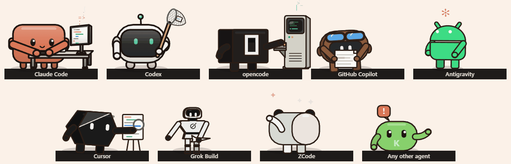
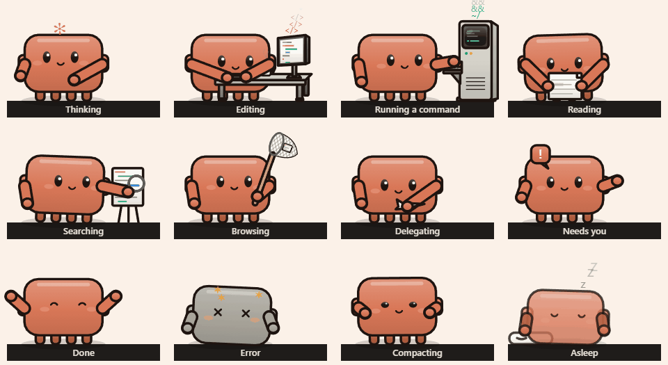
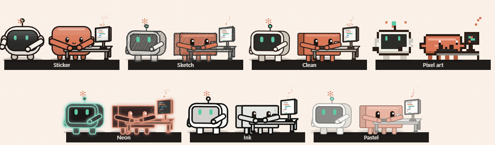
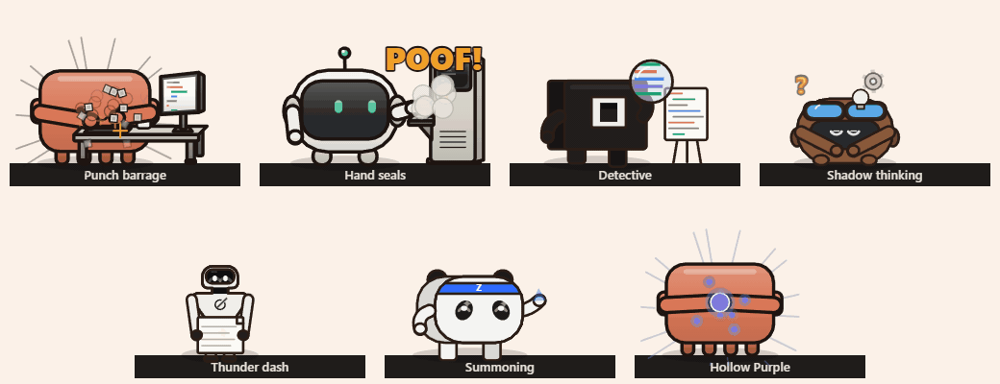

  

  
  
  

# Agent Pets

Animated pets in the Windows 11 taskbar that show what your coding agents are doing. Every session of **Claude Code**, **Codex**, **opencode**, **GitHub Copilot**, **Antigravity**, **Cursor**, **Grok Build** or **ZCode** gets its own pet: it codes at a desk, types commands, reads files, catches web pages with a butterfly net, waves when it needs you and naps when idle. Progress, context and rate limits sit right next to it.

  

  

## Features

- **One pet per session**, posed by what the agent does: thinking, editing, running a command, reading, searching, browsing, delegating, waiting for you, done, error, asleep.
- **Limits at a glance.** 5-hour and weekly bars for Claude, Codex and Antigravity, task progress under each pet, a "+N" badge when the taskbar runs out of room. Claude limits come live from the Claude Code mod, with exact reset times; opt-in plan polling and the Claude app's own samples fill the gaps. See [Agents](docs/agents.md#claude-rate-limits).
- **A mod inside Claude Code.** Live limits, a `/pets` pane with every agent's sessions, nudges when another agent waits or fails, and a pixel Clawd above the prompt. On by default, and installable from the marketplace without the widget (`/plugin marketplace add Marczelloo/agent-pets`). See [Agents](docs/agents.md#the-claude-code-mod).
- **One click back to the session.** The panel lists every session; **Open** brings back the Claude or Codex app, the editor, the terminal, or resumes the session in a new one.
- **Speech bubbles and subagents.** See the question an agent asks or the command it runs; subagents show up as mini pets next to their parent.
- **Seven looks, two ways to move.** Sticker, Sketch, Clean, Pixel art, Neon, Ink and Pastel, plus a Dynamic mode with anime-inspired scenes.
- **Statistics for fun.** A podium of your projects, token and time counters, an agent race, an activity calendar and badges.
- **Your layout.** Next to the tray, on the left, anywhere you drag them or in a floating window; any monitor, any size.
- **Private and light.** Everything is read from local files and hooks; drawing pauses under full-screen apps and slows down on battery.

More in [docs/features.md](docs/features.md).

### Every state

  

### Seven looks

  

### Dynamic motion

  

## Install

1. Download `Agent.Pets_<version>_x64-setup.exe` from [Releases](https://github.com/Marczelloo/agent-pets/releases/latest) and run it. It installs for your user, without administrator rights. Code signing is being set up (see [Code signing policy](#code-signing-policy)); until then SmartScreen may ask: **More info → Run anyway**.
2. The first-run wizard finds your agents and connects them, and lets you pick notifications, autostart and a look.
3. Restart open agent sessions so they pick up the hooks.

Change anything later in **Settings** (right-click the tray icon, or ⚙ in the panel). Updates are signed and install from GitHub; uninstall from Windows Settings → Apps, which also removes the hooks.

## Supported agents

| Agent | Pet | Status | Limits |
|---|---|---|---|
| Claude Code | Clawd | ✅ core | 5h and weekly |
| Codex, incl. [Agent Router](https://github.com/Marczelloo/agent-router-mcp) tasks | Kodek | ✅ core | 5h and weekly |
| opencode | a near-black cyclops | ✅ core | tokens, cost, account bars |
| GitHub Copilot | a pilot in a leather helmet | 🧪 experimental | – |
| Antigravity | the Android robot | 🧪 experimental | Gemini 5h and weekly |
| Cursor | a dark faceted block | 🧪 experimental | – |
| Grok Build | a white robot with a visor | 🧪 experimental | – |
| ZCode | a panda with a “Z” headband | 🧪 experimental | – |
| Anything else | a blob with its first letter | ✅ [the door](docs/door.md) | – |

Claude Code, Codex and opencode get the most care and testing; the experimental ones work through their hooks and were not checked in every detail against a live session. Setup details, what each integration writes and how to undo it: [docs/agents.md](docs/agents.md).

| Panel | First-run wizard | Settings |
|---|---|---|
|  |  |  |

## Privacy

Session data never leaves your computer: states come from local hooks and files, and only titles, progress and counters are kept, never message content. The only network calls are the update check on GitHub (can be turned off) and, if you allow it, fetching your Claude plan limits from `api.anthropic.com`. Details in [docs/privacy.md](docs/privacy.md).

## Code signing policy

From 0.17 on, release installers are built from this repository by the [release workflow](.github/workflows/release.yml) on GitHub Actions, not on a personal computer. Code signing of `Agent.Pets_<version>_x64-setup.exe`, `agent-pets.exe` and `hook.exe` is being requested from [SignPath Foundation](https://signpath.org); once it is granted, this section will say: free code signing provided by [SignPath.io](https://signpath.io), certificate by [SignPath Foundation](https://signpath.org).

- Committers and reviewers: [Marczelloo](https://github.com/Marczelloo)
- Approvers: [Marczelloo](https://github.com/Marczelloo)

Every release is also signed for the in-app updater, which installs only an update with a valid signature. [Privacy](docs/privacy.md) lists every network call the app makes; it sends no other data anywhere.

## Documentation

- [Features](docs/features.md): panel, notifications, bubbles, subagents, statistics, layout
- [Agents](docs/agents.md): setup and behaviour of every integration, rate limits
- [Door for other agents](docs/door.md): give any tool a pet with one HTTP call
- [Privacy](docs/privacy.md): what is read, sent and stored
- [Building](docs/building.md): build from source, `pets-cli`, architecture, releases
- [Contributing](CONTRIBUTING.md)

## License

Agent Pets © 2026 [Marczelloo](https://github.com/Marczelloo), licensed under the [GNU General Public License v3.0 or later](LICENSE). You may use, study, change and share it, also commercially; if you share a changed version, it must stay open source under the same license. Versions up to 0.12.2 were released under the MIT License; see [NOTICE](NOTICE) for earlier terms, contributors, trademarks and third-party artwork.

The Antigravity pet is based on the Android robot, which is reproduced or modified from work created and shared by Google and used according to terms described in the [Creative Commons 3.0 Attribution License](https://creativecommons.org/licenses/by/3.0/).

Agent Pets is not affiliated with Anthropic, OpenAI, GitHub, Google, Cursor, xAI, Z.ai or opencode.
